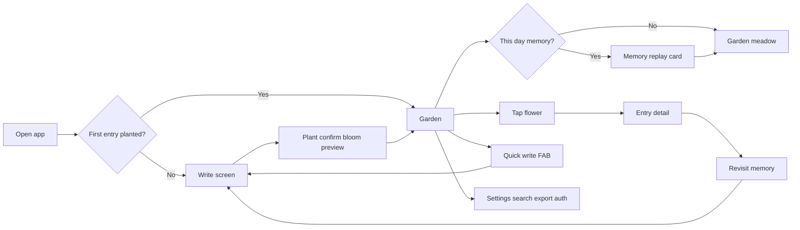

# Bloom Journal — Product Specification (Current State)

> **Mobile development paused (June 2026).** This spec still describes the mobile app as built, but active development is on the web app (`apps/web`). Agents should not read or explore `apps/mobile/` for context unless explicitly asked.

**Version basis:** Codebase as of May 2026. Monorepo: `apps/web`, `apps/mobile`, `packages/core`.

Related specs:

- [Flower decision spec](./flower-decision-spec.md) — how entries become blooms
- [Sync contract](../apps/web/docs/sync.md) — Supabase auth and LWW sync

---

## 1. Vision & positioning

**Bloom Journal** is a mood-aware, private journaling app where every entry becomes a unique flower in a scrollable personal garden. The product promise:

> *Turn every journal entry into a flower, and every flower into a memory in a living garden.*

**Differentiators (implemented):**

- Emotional journaling tied to visual reward (procedural blooms, not stickers)
- Ambient “living” garden backdrop driven by real time, season, weather, and location
- Local-first privacy; cloud backup is optional, not required
- Soft watercolor aesthetic (cream parchment, Cormorant Garamond + Nunito, sage accents, seasonal palettes)

**Target platforms:**

| Platform | Stack | Local storage |
|----------|-------|---------------|
| Web PWA | Next.js 15, Tailwind v4, shadcn/ui | Dexie / IndexedDB |
| Mobile *(paused)* | Expo 54, React Native, Expo Router | SQLite + Drizzle |
| Shared logic | `@bloom/core` | Types, flowers, garden, scene, sync, sentiment |

---

## 2. Primary user journey

1. **First launch** — User lands on Write until they plant their first entry (`hasPlantedFirst` in garden meta).
2. **Write** — Title (optional), content (required), mood (optional), tags, daily prompt; draft auto-saved.
3. **Plant confirm** — Preview of generated bloom; confirm animation; entry persisted (scene snapshot only when planted from garden quick-write; see §3.8).
4. **Garden** — Optional “This day in your garden” memory card on open; horizontal meadow of flowers grouped by month; ambient sky/weather; interact via tap/long-press.
5. **Return visits** — Read entry, favourite, filter garden, start a “revisit” thread linked to a parent memory.
6. **Settings** — Search, JSON backup, optional sign-in and cloud sync.

---

## 3. Core features (implemented)

### 3.1 Journaling

| Capability | Detail |
|------------|--------|
| Entry fields | Title, content, mood, tags, timestamps |
| Moods (picker) | 8: Joyful, Peaceful, Dreamy, Loved, Melancholy, Energized, Grateful, Anxious (`packages/core/src/constants/moods.ts`) |
| Sentiment fallback | Keyword inference when mood not chosen (`packages/core/src/sentiment/infer.ts`) |
| Daily prompts | Rotating writing prompts (`packages/core/src/constants/prompts.ts`) |
| Draft persistence | Write draft saved locally between sessions |
| Scene snapshot | At plant time: weather, time-of-day phase, season stored on entry (`packages/core/src/scene/types.ts`) |

### 3.2 Flowers & blooms

Each entry gets a **deterministic procedural flower** from entry data (seed, mood, word count, tags, age). See [flower-decision-spec.md](./flower-decision-spec.md).

| App mood(s) | Visual bloom |
|-------------|--------------|
| Joyful (+ ecstatic triggers) | Joy daisy (or pumpkin easter egg) |
| Peaceful, Dreamy | Calm lavender |
| Loved | Love rose |
| Melancholy | Wistful bluebells |
| Energized, Anxious | Restless dahlia |
| Grateful | Hopeful tulip |

**Pumpkin easter egg:** Rare/special blooms for ecstatic-level joy (keywords, `!!!`, or deterministic seed surprise); ages through stages over ~20+ days (`packages/core/src/flowers/genome.ts`).

**Favourites:** Favourited entries render larger in the garden.

### 3.3 Garden

| Capability | Detail |
|------------|--------|
| Layout | Organic positions, monthly clusters (`packages/core/src/garden/layout.ts`) |
| Navigation | Horizontal pan/scrub; timeline scrubber (web) |
| Filters | By mood or month (long-press / action drawer) |
| Wilt | Visual wilt when user inactive 3+ days; copy nudges to write (`packages/core/src/garden/wilt.ts`) |
| Anniversary | Accent for entries ~1 year old (`packages/core/src/garden/anniversary.ts`) |
| Revisit threads | Child entries linked via `revisitOf` to parent memory |
| Soft delete | `isDeleted` flag; entry hidden from garden |

### 3.4 Ambient live scene (garden background)

Not decorative wallpaper — **contextual atmosphere** from device location and APIs:

- **Weather** — Open-Meteo (`packages/core/src/scene/open-meteo.ts`)
- **Place label** — Nominatim reverse geocode (`packages/core/src/scene/nominatim.ts`)
- **Time phases** — `deep_night`, `pre_dawn`, `dawn`, `day`, `golden_hour`, `dusk`, `night`
- **Moon phase** — Celestial layer (`packages/core/src/scene/moon-phase.ts`)
- **Seasonal palettes** — `packages/core/src/theme/seasons.ts`

Layers: sky, sun/moon/stars, weather particles, grass sway, pollen sparkles, ground textures. Web dev previews at `/preview/*` (`apps/web/lib/scene/preview-scenes.ts`).

### 3.5 Entry detail & actions

From garden flower tap or direct route `/entry/[id]`:

- Read full entry + rendered flower
- Favourite / unfavourite
- **Revisit this memory** — spawns linked bloom and write flow
- Soft delete
- Revisit count badge on threaded memories

### 3.6 Search, backup, privacy

| Feature | Web | Mobile |
|---------|-----|--------|
| Full-text keyword search | Yes | Yes |
| JSON backup export | Yes | Yes |
| PIN / biometric app lock | UI stub (“coming soon”) | Implemented (`LockGate`) |
| Daily writing reminders | Stub | Implemented (requires dev build, not Expo Go) |

> Mobile column reflects the last built state. Mobile development is paused (June 2026); new work targets web only.

### 3.7 Optional cloud (Supabase)

**Not required to use the app.** Without env vars, all data stays local with `userId: 'local'`.

When configured (`apps/web/docs/sync.md`):

- **Auth** — Email/password + Google OAuth
- **Sync** — Last-write-wins (LWW) on `entries`, `garden_meta`, `app_settings`
- **Triggers** — Push debounced ~2s after local writes; pull on sign-in and app focus/visibility
- **Migration** — One-time local → cloud user migration dialog when signing in with existing local data
- **Never synced** — PIN hash, write drafts, biometric flags (client-only)

**Not in v1:** Realtime sync, file attachments, Supabase Storage.

### 3.8 Memory Replay (“This day in your garden”)

Proactively surfaces a past memory when the user opens the garden — no AI, deterministic copy from data already on the entry.

| Item | Detail |
|------|--------|
| Trigger | Garden screen after first entry planted (`hasPlantedFirst`) |
| Match | Entries on today’s calendar month + day from a **prior year**; `isDeleted` excluded |
| Selection | Among matches, prefer **smallest years ago** (e.g. one year ago over two on the same date) |
| Narrative | `packages/core/src/garden/memory-replay.ts` — time phase, weather, place label, title/content excerpt |
| Actions | Tap card → entry detail; dismiss → hidden for rest of local calendar day |
| Dismiss storage | Client-only (`localStorage` web, SecureStore mobile); not synced |

**Scene snapshot caveat:** Write → Plant confirm does not pass live scene into `plantEntry` today; only garden quick-write does. Entries without `weather` / `timePhase` still get a shorter line (e.g. “One year ago, you wrote about …”).

---

## 4. Data model

Canonical types: `packages/core/src/types.ts`. Cloud mirror: `supabase/migrations/20250524120000_initial_sync_schema.sql`.

### Entry (`EntryRecord`)

| Field | Purpose |
|-------|---------|
| `id`, `userId` | Identity (`local` until signed in) |
| `title`, `content` | Journal text |
| `mood`, `inferredSentiment` | Emotional tagging |
| `tags[]` | User labels |
| `createdAt`, `updatedAt` | Timestamps + LWW sync |
| `flowerSeed`, `flowerStyle` | Deterministic bloom metadata |
| `gardenPosition` | x/y/z, rotation, scale on canvas |
| `isFavourited`, `revisitOf`, `isDeleted` | Garden behaviour |
| `weather`, `timePhase`, `sceneSeason` | Ambient snapshot at plant |
| `syncedAt`, `pendingPush` | Sync state (local DB) |

### Garden meta (`GardenMeta`)

`theme`, `layoutMode`, `lastEntryAt`, `hasPlantedFirst`, `unlockedSeasons[]`, `createdAt`

### App settings (`AppSettings`)

Syncable: reminder time/enabled. Client-only: `pinHash`, `writeDraft`, biometric flags (mobile).

---

## 5. Screen map

### Web (`apps/web/app/`)

| Route | Purpose |
|-------|---------|
| `/` | Redirect → write or garden |
| `/write` | New/edit entry |
| `/plant-confirm` | Bloom confirmation (nav hidden) |
| `/garden` | Main experience |
| `/entry/[id]` | Entry detail |
| `/revisit/[parentId]` | Threaded revisit write |
| `/settings` | Search, backup, auth, sync status |
| `/login` | Auth |
| `/flowers` | Mood bloom gallery (dev/reference) |
| `/preview/*` | Fixed scene previews (dev) |

Bottom nav: Garden / + Write / Settings (`apps/web/components/nav/AppNav.tsx`).

### Mobile (`apps/mobile/app/`) — development paused

Same logical screens via Expo Router; app lock overlay in root layout. **Not under active development (June 2026).**

---

## 6. Integrations & dependencies

| Integration | Role | Notes |
|-------------|------|-------|
| Open-Meteo | Live weather | Client-side, no API key |
| Nominatim | Location label | Client-side geocoding |
| Supabase | Auth + Postgres sync | Optional; RLS per `auth.uid()` |
| Local sentiment | Keyword inference | No external ML API |

**No custom backend server** — one Next.js route for OAuth callback (`apps/web/app/auth/callback/route.ts`).

---

## 7. Explicit non-goals / not yet shipped

Use this section to scope future work vs current product:

| Area | Status |
|------|--------|
| Service worker / offline install caching | Not implemented (manifest only) |
| Web PIN lock | Backend exists; settings UI stub |
| Web daily reminders | Stub |
| File/image attachments | Not implemented |
| Realtime multi-device sync | Pull on focus only |
| Edge functions / custom API | None |
| Forced account creation | Never — local-first default |

Root `README.md` roadmap is **partially outdated** (e.g. `@bloom/core` and flower rendering are already implemented).

---

## 8. Success metrics (suggested for spec follow-on)

Not implemented in code — useful if extending this doc into a full PRD:

- Activation: first entry planted (`hasPlantedFirst`)
- Retention: return writes within 3 days (wilt system already encodes 3-day inactivity)
- Engagement: revisits per entry, favourites count
- Optional cloud: sign-in rate, sync conflict rate

---

## 9. Technical constraints (for product/engineering alignment)

- **Privacy default:** All journaling works offline; cloud is opt-in backup
- **Deterministic flowers:** Same entry always renders the same bloom (important for “memory” metaphor)
- **Platform parity:** Core behaviour shared via `@bloom/core`; mobile development is paused (June 2026) — web is the active target
- **Activation:** Supabase requires env vars + dashboard auth provider setup per `apps/web/docs/sync.md`

---

## 10. One-paragraph elevator pitch

Bloom Journal is a private, mood-aware journal that grows a unique procedural flower for every entry you write. Your memories form a scrollable garden organised by month, set against a living sky that reflects your real weather, time of day, season, and moon phase. The app works fully offline on web and phone; you can optionally sign in to back up and sync across devices. Gentle mechanics — wilt when you have not written in a few days, anniversary highlights, a “this day in your garden” memory card, revisit threads, and rare pumpkin blooms — reward consistency and emotional honesty without gamifying streaks.

---

## 11. Planned features (not yet shipped)

| Feature | Depends on | Notes |
|---------|------------|-------|
| **Memory letters** | JSON backup v1 (`apps/web/lib/export/backup.ts`), formatted export UI | Beautiful letter export from a past entry; share or save. Export/share first; Google Drive is not integrated today (optional later). |
| **Sentiment timeline** | `mood`, `inferredSentiment` on every entry | Chart view across the garden — emotional trends week over week. |
| **Auto-tagging** | On-device inference + accept/dismiss UI before plant | Suggest people, places, themes after entry creation; no external ML API in v1. |

**Follow-up (Memory Replay quality):** Pass live scene snapshot into `plantEntry` on plant-confirm so more entries have rich replay copy.
